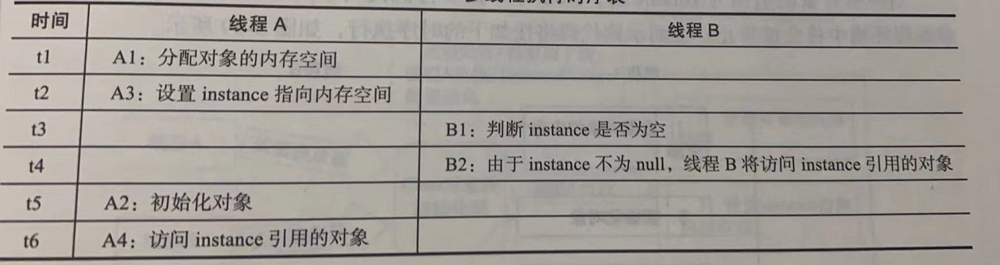
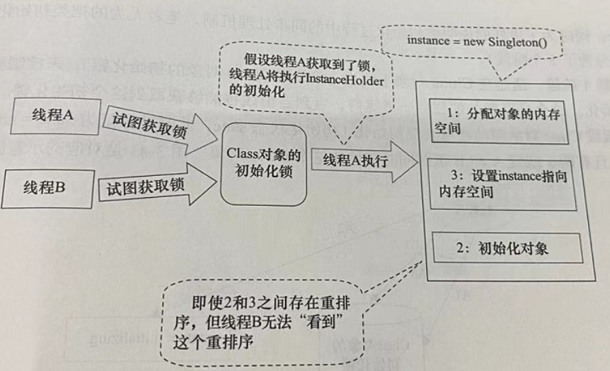

# java并发编程的艺术

```这章是真的晦涩，只提取了我认为有启发的知识点```   

核心学习内容：从多个方面去体会理解JMM，能有个比较深入的了解，解决java并发编程中经常遇到的各种内存可见性问题       


## 第三章重点内容  
### 3.1 java内存模型的基础
###### java内存模型(JMM)
java并发采用的是共享内存模型，线程之间的通信是透明的,由JMM控制，JMM决定一个线程对共享变量的写入何时对另一个线程可见  

###### 下面是线程通信的抽象解析  
线程之间的共享变量存储在主内存中，每个线程都有一个私有的本地内存(JMM的抽象概念，实际上并不存在)  
1）线程A把本地内存A中更新的共享变量刷新到主内存中  
2）线程B从主内存中读取共享变量  
**JMM通过控制主内存与每个线程的本地内存之间的交互，来为java新成员提供内存可见性保证**  

JMM的抽象模型   

    

举例子：   
    

如图3-2所示,本地内存A和本地内存B由主内存中共享变量x的副本。假设初始时，这3个内存中的x值都为0。线程A在执行时，把更新后的x值(假设值为1)临时存放在自己的本地内存A中。当线程A和线程B需要通信时,线程A首先会把自己本地内存中修改后的x值刷新到主内存中,此时主内存中的x值变为了1。随后，线程B到主内存中去读
取线程A更新后的x值,此时线程B的本地内存的x值也变为了1。
从整体来看,这两个步骤实质上是线程A在向线程B发送消息，而且这个通信过程必须要经过主内存。

JMM通过控制主内存与每个线程的本地内存之间的交互，来为Java程序员提供内存可见性保证。 


###### 内存可见性  
内存可见性(Memory Visibility)是指当某个线程正在使用对象状态而另一个线程在同时修改该状态,需要确保当一个线程修改了对象状态后,其他线程能够看到发生的状态变化。  

###### 重排序  
``为了提高性能，编译器和处理器常常会对指令做重排序，分为三种类型``  
1.编译器优化的重排序   
2.指令级并行的重排序，将多条指令重叠执行，如果不存在数据依赖性，处理器可以改变语句对应机器指令的执行顺序  
3.内存系统的重排序，处理器使用缓存和读写缓冲区  
源代码到最终执行的指令序列，会分别经历1，2，3种重排序类型  

###### 现代处理器使用写缓冲区临时保存向内存写入的数据，每个处理器上的写缓冲区只对所在的处理器可见  
**上述特性会导致处理器对内存的读写操作顺序不一定与内存实际的读写操作顺序一致!**  

###### happens-before  
``如果一个操作执行的结果需要对另一个操作可见，那么这两个操作之间必须要存在happens-before关系,这里的操作可以一个线程内也可以多个线程间 ``  
* 程序顺序规则:一个线程的每个操作，happens-before于该线程中的任意后续操作  
* 监视器锁规则：对一个锁的解锁，happens-before于随后对这个锁的加锁  
* volatile变量规则:对一个volatile域的写，happens-before于后续的读  
* 传递性，A --> B,B-->C,则A-->C (-->代表happens-before)

两个操作之间具有happens-before关系，并不意味着前一个操作必须在后一个操作之气执行  
仅仅要求前一个操作对后一个操作可见，且前一个操作按顺序排序在第二个操作之前  

### 3.2 重排序  
  重排序是指编译器和处理器为了优化程序性能而对指令序列进行重新排序的一种手段  

###### 数据依赖性  
如果两个操作访问同一个变量，且这两个操作中有一个为写操作，此时这两个操作之间就存在数据依赖性  
  
| 名称 | 代码示例 | 
| ---  |   ---   | 
| 写后读| a=1;b=a; | 
| 写后写| a=1;a=2; |
| 读后写| a=b;b=1;|  

编译器和处理器会遵守数据依赖性，不会改变存在数据依赖关系的两个操作的执行顺序(单处理器和单线程情况下)  

###### as-if-serial语义  
不管怎么重排序，单线程执行的结果不能被改变  
###### 重排序对多线程的影响  
单线程的时候不会改变执行结果，但在多线程中对存在控制依赖的操作重排序时，可能会改变程序的执行结果  
### 3.3顺序一致性  
顺序一致性内存模型是一个理论参考模型，在设计的时候，处理器的内存模型和编程语言的内存模型都会以顺序一致性的内存模型进行参照  
###### 数据竞争与顺序一致性            
数据竞争: 在一个线程中写一个变量，在另一个线程读同一个变量，而且写和读没有通过同步来排序  
如果这个多线程能正确同步，这个程序是一个没有数据竞争的程序  

----
JMM对正确同步的多线程程序的内存一致性做了保证：    **注意这里是对正确同步，不同步的话和理想的顺序一致性模型那是不一样的**     

----

正确同步的程序执行将具有顺序一致性 —— 程序的执行结果与程序在顺序一致性模型中的执行结果相同      
这里说的同步是广义的包括正确使用Synchronized，volatile，final   


###### 详解顺序一致性模型 
它为程序员提供了极强的内存可见性保证   
**两大特性**     
1. 一个线程中的所有操作必须按照程序的顺序来执行    
2. 不管程序是否同步，所有线程都只能看到一个单一的操作执行顺序。每个操作都必须原子执行并立刻对所有线程可见  
**顺序一致性模型视图**    
    

**顺序一致性模型有一个单一的全局内存，通过左右摇摆连接到任意一个线程，最多只有一个线程可以连接到内存**   
**并发执行时：将所有线程的内存读写操作串行化**
1）AB线程正确同步的执行效果：    
   
所有线程只能看到一致执行顺序A1->A2->A3->B1->B2->B3   
2）AB线程没有做同步的执行效果：    
   
虽然没有同步，导致整体执行顺序无序，但是所有线程都只能看到一个一致的整体顺序：B1->A1->A2->B2->A3->B3    

**但是在JMM中未同步程序没有这个特性，不仅执行顺序无序而且线程看到的整体执行顺序也不一样**  

###### 在顺序一致性模型中，所有操作完全按程序的顺序串行执行，而在JMM中，是可以有在临界区内代码的重排序操作的   


###  3.4 volatile的内存语义    
#### volatile特性  
* 可见性：对一个volatile变量的读，总是能看到任意线程对这个volatile变量最后的写入
* 原子性：对任意**单个**volatile变量的读/写具有原子性，(类似于volatile++这种复合操作除外)

多个线程对**单个**volatile变量的读写操作与一个普通变量加了同一个锁来同步的效果是一样的     

锁的happens-before规则保证释放锁和获取锁的两个线程之间的内存可见性，这意味对一个volatile变量的读，都能看到任意线程对这个变量最后的写(修改)    


这里说明，只要你用的是jdk5及以后的版本，volatile变量的读写可以实现线程之间的通信    

#### volatile读写的内存语义          

内存语义来说，锁的**获取和释放**可以和volatile的**写和读**对应   (注意顺序，获取和写对应)           

当写一个volatile变量时，JMM会把该线程对应的本地内存中的共享变量值刷新到主内存   

当读一个volatile变量时，JMM会把该线程对应的本地内存设置为无效。线程接下来将从主内存读取共享变量    


知识点总结：    
线程A写一个volatile变量，实际上是线程A向接下来将要读这个volatile变量的某个线程发出了其对共享变量所作修改的消息
线程B读一个volatile变量，实际上是线程B接收了之前某个线程发出的信息(这个线程是写volatile)    
线程A写volatile变量到线程B读volatile变量，实质上是A通过主内存向B发送消息   

     


#### volatile内存语义的实现   
简单来说就是JMM会限制编译器重排序和处理器重排序   

编译器在在生成字节码的时候，在指令序列中插入内存屏障，来禁止特定类型的处理器重排序   
JMM采取保守策略(首先保证正确再保证效率)来插入内存屏障。    

对volatile写
* 在每个volatile写操作的前面插入一个StoreStore屏障: 禁止上面的普通写和volatile写重排序（也就是普通写和volatile写不能重排序，于是之前的所有普通写我们都可见）   
* 在每个volatile写操作的后面插入一个StoreLoad屏障: 防止volatile写与后面可能存在的volatile读/写操作重排序（也就是说volatile和volatile之间不能重排序）       


对volatile读    
* 在每个volatile读的后面插入一个LoadLoad的屏障: 禁止volatile读和后面的普通读重排序     
* 在每个volatile读的后面插入一个loadStore屏障: 禁止处理器把volatile读与后面的普通写重排序       


知道屏障的作用就好了，什么Store什么Load记住也没多大用    

## 3.5 锁的内存语义

当线程释放锁时，JMM会把该线程对应的本地内存中的共享变量刷新到主内存中     
当线程获取锁时，JMM会把该线程对应的本地内存设置为无效，从而使得被监视器保护的临界区代码必须去主内存读取共享变量       


总结:        
* 线程A释放一个锁，实质上是线程A向接下来将要获取这个锁的某个线程发出了(线程A对共享变量所做修改的)信息   

* 线程B获取一个锁，实质上是线程B接收了之前某个线程发出的(在释放这个锁之前对共享变量的修改)消息   


线程A释放锁，随后线程B获取这个锁，这个过程实质上是线程A通过主内存向线程B发送消息    


     


#### volatile和锁简单对比
volatile仅仅保证对单个volatile变量的读/写具有原子性，而锁的互斥执行的特性可以确保对整个临界区代码的执行具有原子性。
在功能上锁比volatile更强大   
在可伸缩性(不会像锁那样造成线程阻塞)和执行性能上，volatile更有优势

您只能在有限的一些情形下使用 volatile 变量替代锁。要使 volatile 变量提供理想的线程安全，必须同时满足下面两个条件：
* 对变量的写操作不依赖于当前值。
* 该变量没有包含在具有其他变量的不变式中


## 3.6 final域的内存语义    
与锁和volatile相比，对final域的读和写更像是普通的变量访问    


##### final域的重排序规则
* 1.在构造函数内写final，与随后把这个被构造对象的引用赋值给一个引用变量，这两个操作之间不能重排序    
* 2.初次读一个包含final域的对象，和初次读这个final域之间不能重排序    


###### 对第一条也就是写final域的重排序：   
JVM禁止把final域的写重排序到构造函数外        
编译器会在final域写之后，构造函数return之前，这个区间内插入内存屏障         

总结：   
写重排序规则可以保证在对象引用为任意线程可见之前，对象的final域已经正确初始化，而普通域没有这个保证     

###### 对第二条也就是读final域的重排序     
JVM禁止处理器重排序读对象引用与读对象包含的final域       
编译器会在读final域之前插入内存屏障       

总结： 确保先读到对象，是为了保证引用对象内的final域一定被初始化过     

上面的是final普通类型，下面看看当final为引用类型时    
 
#### 当final域为引用类型时     
在构造函数内对一个final引用的对象的成员域的写入,与随后在构造函数外把这个被构造对象的应用赋值给一个引用变量，这两个操作之间不能重排序    


## 可以看到不管是什么类型的final的域，都是不能溢出到构造函数外的       

在构造函数返回前，被构造对象的引用不能为其他线程所见，因为此时的final域可能还没有初始化。在构造函数返回后，任意线程都将保证能看到final域正确初始化的值     


 


## 3.7 happens-before
happens-before是JMM最核心的概念    

1) 如果一个操作happens-before另一个操作，那么第一个操作的执行结果将对第二个操作可见，而且第一个操作的执行顺序排在第二个操作之前    
2) 两个操作之间存在happens-before关系，java允许重排序的，但是重排序的结果是要和happens-before的执行结果一致     

as-if-serial保证单线程内程序的执行结果不被改变      
happens-before保证正确同步的多线程程序的执行结果不被改变     


happens-before是被JMM控制的，用禁止重排序来实现    
对于会改变程序执行结果的重排序，JMM要求编译器和处理器必须禁止这种重排序       
对于不会改变的，JMM不做要求      

#### happens-before规则
1) 程序顺序规则：一个线程中的每个操作，happens-before于该线程中的任意后续操作
2) 监视器锁规则： 对一个锁的解锁，happens-before于随后对这个锁的枷锁
3) volatile变量规则：对一个volatile域的写，happens-before于任意后续对这个volatile域的读
4) 传递性，如果A happens-before B，B happens-before C，则A happens-before C
5) start()规则： 如果线程A执行操作ThreadB.start(),那么A线程的ThreadB.start()操作happens-before于线程B中的任意操作         
6) join()规则： 如果线程A执行操作ThreadB.join(),那么线程B中的任意操作happens-before于线程A从ThreadB.join()操作成功返回          
 

## 3.8 双重检查锁定与延迟初始化   

首先，双重检查锁定是错误的做法，因为引用的对象可能还没有完成初始化   

```java  
public class myclass{
    private static Instance instance;
    public static Instance getInstance() {
          //第一次检查
        if(instance == null) {       
            //加锁
            sychronized(myclass.class);   
            //第二次检查   
            if(instance == null) {
                //问题的根源   
                instance = new Instance();    
            }
        }
        return instance;
    }
}   
```     
对单线程来说，java内存模型保证重排序之后结果是不变的         

而在多线程的情况下，看下表    

      
A2 和 A3的操作在单线程情况下重排序是没事的，但是当线程B进行B1操作时，A3 A2重排序的结果导致B1判断instance不为空，然后去访问instance，于是   
出现B访问了一个还未初始化的对象    


在知道问题出现的原因后，来看看解决方法（线程安全的延迟初始化技术）        
我们可以从两个方面去解决这个问题：
* 不允许A2和A3操作重排序 
* 允许A2和A3重排序，但是不允许其他线程看到这个修改   


方法一就是用volatile去定义那个instance   
```java
public class myclass{
    private volatile static Instance instance;
    public  static Instance getInstance() {
        //第一次检查
        if(instance == null) {
            //加锁
            sychronized(myclass.class);
            //第二次检查   
            if(instance == null) {
                //问题的根源   
                instance = new Instance();  //改为了volatile之后就好了   
            }
        }
        return instance;
    }
}   
```
----

方法二：基于类初始化的修改方案   
JVM在类的初始化阶段，会执行类的初始化，在执行类的初始化期间，JVM会去获取一个锁，这个锁会同步多个线程对同一个类的初始化    

```java
public class myclass{
    private static class InstanceHolder{
        private  static Instance instance = new Instance();    
    }
    
    public  static Instance getInstance() {
        return InstanceHolder.instance;
    }
}   
```

假设线程A和线程B执行getInstance方法   
       


初始化一个类，包括执行这个类的静态初始化和初始化在这个类中声明的静态字段，在首次发生下列任意一种情况时，一个类或    
接口类型T将被立即初始化    
* 1)T是一个类，而且一个T的实例将要被创建
* 2)T是一个类，且T中的一个静态方法被调用
* 3)T中声明的静态字段被赋值
* 4)T中声明的一个静态字段被使用，而且这个字段不是final字段（常量字段）   
* 5)T是一个顶级类   

这里符合第四种情况:InstanceHolder的静态字段instance被线程A的getInstance()使用了      

下面用五个阶段来说明这个过程，前四个阶段是A和B调用的过程，第五个阶段是一个新的线程C调用getInstance方法    

###### 第一阶段:通过在Class对象上同步（获取Class对象的初始化锁），来控制类或接口的初始化。这个获取锁的线程会一直等待，指代当前线程能获取到这个初始化锁   

线程A获取到这个初始化锁，然后B等待获取这个初始化锁直到可以获取为止    

###### 第二阶段：线程A执行类的初始化，同时线程B在初始化锁对应的condition上等待

###### 第三阶段：线程A初始化结束了，然后唤醒condition上所有正在等待的线程，A释放锁，A完成初始化   

###### 第四阶段，线程B被唤醒，获取到初始化锁，发现这个Class对象已经初始化了，于是释放锁，B完成初始化   

###### 第五阶段，线程C获取到初始化锁，然后发现state=initialized，于是释放锁，C完成初始化   


